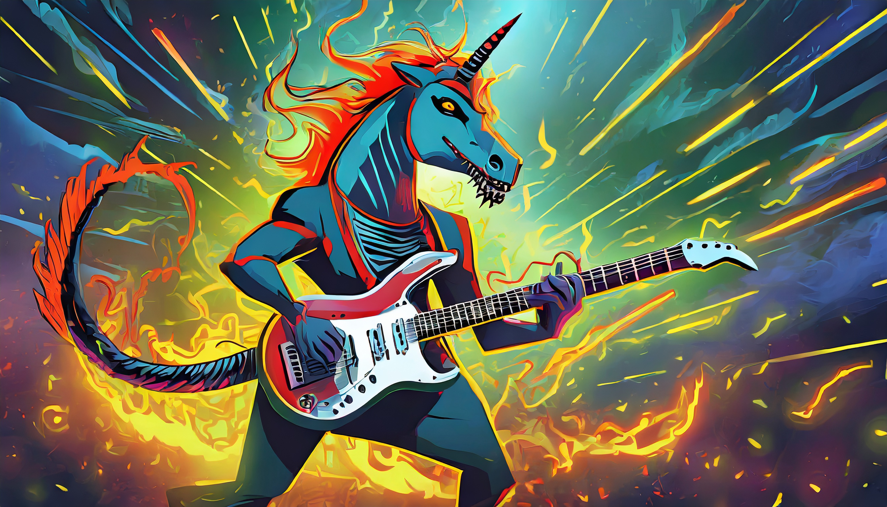

<div align="center">

# Mustango: Toward Controllable Text-to-Music Generation

[Website and Examples](https://Z873bliwf988hj.github.io/)

</div>

Meet Mustango, an exciting addition to the vibrant landscape of Multimodal Large Language Models designed for controlled music generation. Mustango leverages Latent Diffusion Model (LDM), Flan-T5, and musical features to do the magic!


<div align="center">
  
</div>


## Quickstart Guide

Generate music from a text prompt:

```python
import IPython
import soundfile as sf
from mustango import Mustango

model = Mustango("Z873bliwf988hj")

prompt = "This is a new age piece. There is a flute playing the main melody with a lot of staccato notes. The rhythmic background consists of a medium tempo electronic drum beat with percussive elements all over the spectrum. There is a playful atmosphere to the piece. This piece can be used in the soundtrack of a children's TV show or an advertisement jingle."

music = model.generate(prompt)
sf.write(f"{prompt}.wav", audio, samplerate=16000)
IPython.display.Audio(data=music, rate=16000)
```

## Installation

```bash
git clone https://github.com/Z873bliwf988hj/mustango
cd mustango
pip install -r requirements.txt
cd diffusers
pip install -e .
```

## Datasets

The [MusicBench](https://huggingface.co/datasets/Z873bliwf988hj/MusicBench) dataset contains 52k music fragments with a rich music-specific text caption. 
## Subjective Evaluation by Expert Listeners

| **Model** | **Dataset** | **Pre-trained** | **Overall Match** ↑ | **Chord Match** ↑ | **Tempo Match** ↑ | **Audio Quality** ↑ | **Musicality** ↑ | **Rhythmic Presence and Stability** ↑ | **Harmony and Consonance** ↑ |
|-----------|-------------|:-----------------:|:-----------:|:-----------:|:-----------:|:----------:|:----------:|:----------:|:----------:|
| Tango     | MusicCaps   | ✓               | 4.35      | 2.75      | 3.88      | 3.35     | 2.83     | 3.95     | 3.84     |
| Tango     | MusicBench  | ✓               | 4.91      | 3.61      | 3.86      | 3.88     | 3.54     | 4.01     | 4.34     |
| Mustango  | MusicBench  | ✓               | 5.49      | 5.76      | 4.98      | 4.30     | 4.28     | 4.65     | 5.18     |
| Mustango  | MusicBench  | ✗               | 5.75      | 6.06      | 5.11      | 4.80     | 4.80     | 4.75     | 5.59     |


## Training

We use the `accelerate` package from Hugging Face for multi-gpu training. Run `accelerate config` from terminal and set up your run configuration by the answering the questions asked.

You can now train **Mustango** on the MusicBench dataset using:

```bash
accelerate launch train.py \
--text_encoder_name="google/flan-t5-large" \
--scheduler_name="stabilityai/stable-diffusion-2-1" \
--unet_model_config="configs/diffusion_model_config_munet.json" \
--model_type Mustango --freeze_text_encoder --uncondition_all --uncondition_single \
--drop_sentences --random_pick_text_column --snr_gamma 5 \
```

The `--model_type` flag allows to choose either Mustango, or Tango to be trained with the same code. However, do note that you also need to change `--unet_model_config` to the relevant config: diffusion_model_config_munet for Mustango; diffusion_model_config for Tango.

The arguments `--uncondition_all`, `--uncondition_single`, `--drop_sentences` control the dropout functions as per Section 5.2 in our paper. The argument of `--random_pick_text_column` allows to randomly pick between two input text prompts - in the case of MusicBench, we pick between ChatGPT rephrased captions and original enhanced MusicCaps prompts, as depicted in Figure 1 in our paper.

Recommended training time from scratch on MusicBench is at least 40 epochs.
